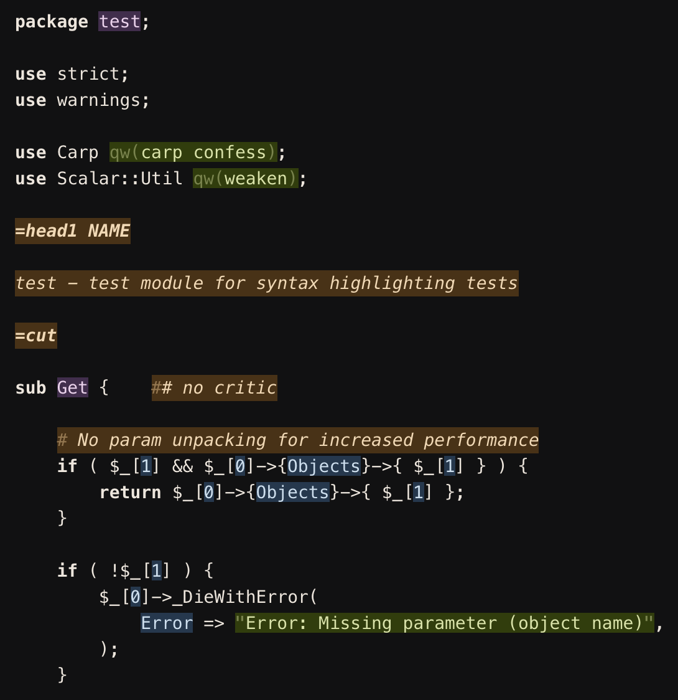

# handsome-dark-syntax

A syntax theme for Atom that helps one focus on the important and avoid being distracted by multitudes of styles and colors.

## Screenshot

## Principles

### Minimal highlighting, just 5 classes:

1. Strings
2. All statically known constants (numbers, keywords, boolean, etc)
3. Global definitions
4. Standard language keywords (def, if, else, etc)
5. Comments

## Supported languages

- Clojure
- CSS
- Elixir
- GitHub Markdown
- HTML
- JavaScript
- Ruby
- Perl
- PHP
- Python
- XML
- YAML

## Install

From the command line:

`apm install handsome-dark-syntax`

Directly in Atom:

- Go to **Settings > Install**
- Search for `handsome-light-syntax` and click **Install**
- Go to **Settings > Themes** and choose **Handsome Light** from the dropdown menu
- Happy coding! :heart:

### Thanks

Forked from [handsome-light-syntax](https://github.com/mgruner/handsome-light-syntax) by mgruner, who...

Forked from the (inactive) [Chestnut Light Atom](https://github.com/biletskyy/chestnut-light-atom-syntax) syntax theme by [Dmitry Biletskyy](https://github.com/biletskyy).
